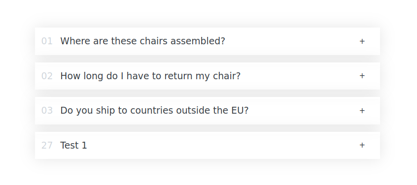

# Accordion Component

The Accordion Component is a simple and functional UI element that allows users to expand and collapse sections of content. This project showcases the functionality of a standard accordion with interactive features, enabling better content management and user engagement.

## Features

- Clickable titles to expand/collapse content.
- Each section displays a question and corresponding answer.
- Clean and organized design for a pleasant user experience.

## 🛠️ Tech Stack

| Technology | Description |
|------------|-------------|
| React.js | For building the user interface |
| JavaScript | To handle calculations and interactivity | 
| HTML5 | Structure and semantic markup |
| TailwindCSS | Utility-first CSS framework for styling |

## Getting Started

1. Clone the repository to your local machine:
   ```bash
   git clone https://github.com/Briso10-dev/Proejct-Accordion

2. Navigate to the project directory:
   ´´´bash
   cd Eat-n-split

3. Install the required dependencies:
    ´´´bash
    npm install

4. Start the development server:
    ´´´bash
    npm start

Project Structure

    src/: Contains all the React components and logic.
    public/: Contains the HTML file and any static assets.

## 📸 Screenshots



## 🙏 Acknowledgments

- Thanks to all contributors who helped in building this project
- Inspiration from modern e-commerce platforms
- Tailwind CSS community for the excellent documentation

## 👥 Authors

- [@Briso-dev](https://github.com/Briso10-dev) - Frontend Development

## 📄 License

This project is open source and available under the [MIT License](LICENSE).